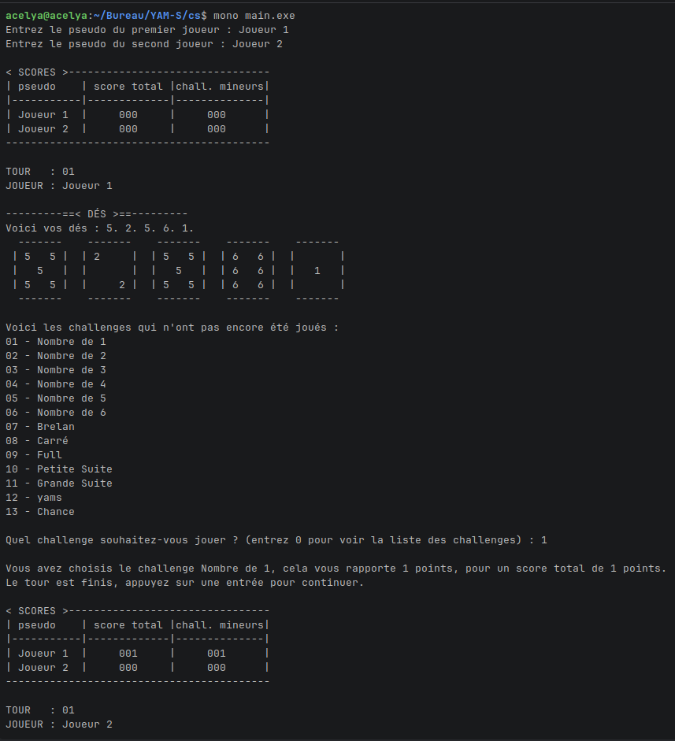
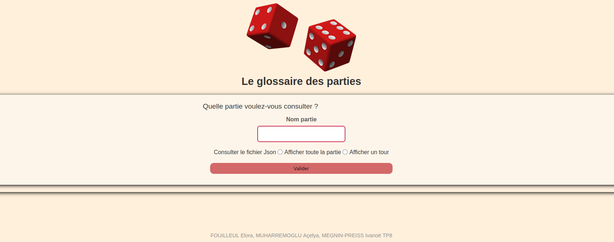

# Yam's - Jeu de dés en console avec interface web

> **Projet académique** - Développement d'un jeu de Yam's complet en C# avec visualisation web des résultats

## À propos

Ce projet est un **jeu de Yam's** (aussi appelé Yahtzee) développé dans le cadre du cours de programmation à l'IUT. Le jeu se joue entièrement dans le terminal et génère automatiquement un fichier JSON contenant l'historique complet de la partie, consultable via une interface web élégante.

### Contexte du projet
- **Formation** : IUT - Cours de programmation
- **Objectif** : Création d'un jeu interactif en console avec export et visualisation de données
- **Particularité** : Projet d'initiation à la programmation (pas de POO, architecture monolithique)

---

## Captures d'écran

### Interface console
<div align="center">
  
  <p><em>Le jeu en cours d'exécution dans le terminal</em></p>
</div>

### Interface web
<div align="center">
  
  <p><em>L'affichage des résultats dans la page web</em></p>
</div>

---

## Technologies utilisées

| Composant | Technologies |
|-----------|-------------|
| **Jeu principal** | C# (console) |
| **Interface web** | HTML5, CSS3, JavaScript (vanilla) |
| **Format de données** | JSON |
| **Environnement** | .NET Framework / Mono |

---

## Fonctionnalités

### Jeu en console (C#)

**Mécanique de jeu**
- Partie complète de Yam's pour 2 joueurs
- Système de lancer de dés avec 3 tentatives maximum par tour
- Choix interactif des dés à conserver entre chaque lancer
- 13 tours de jeu (un par challenge disponible)

**Gestion des challenges**
- 6 challenges mineurs (somme des 1, 2, 3, 4, 5 ou 6)
- 7 challenges majeurs (brelan, carré, full, petite suite, grande suite, yams, chance)
- Calcul automatique du bonus (35 points si ≥ 63 points dans les challenges mineurs)

**Interface utilisateur**
- Affichage visuel des dés en ASCII art
- Tableau de scores en temps réel
- Navigation intuitive avec validation des entrées
- Vérification de la taille de la console pour un affichage optimal

**Export des données**
- Génération automatique d'un fichier `res.json` à la fin de la partie
- Structure JSON complète : paramètres, joueurs, tours détaillés, scores finaux

### Interface web (HTML/CSS/JS)

**Modes d'affichage**
- **Vue globale** : Affichage complet de la partie (paramètres, joueurs, scores finaux)
- **Vue tour par tour** : Navigation interactive dans l'historique de la partie

**Visualisation des données**
- Tableau récapitulatif des scores finaux avec bonus
- Détail de chaque tour : dés obtenus, challenge choisi, points marqués
- Navigation fluide entre les tours (boutons précédent/suivant)
- Design responsive et épuré

**Source de données**
- Lecture locale du fichier `res.json` (fonctionne hors ligne)
- Serveur distant IUT (yams.iutrs.unistra.fr:3000) - **inactif aujourd'hui**

---

## Installation

### Prérequis
- Compilateur C# (Visual Studio, VS Code avec extension C#, ou Mono)
- Un navigateur web moderne
- Terminal avec hauteur minimale de 34 lignes

### Étapes d'installation

**1. Cloner le dépôt**
```bash
git clone https://github.com/AmbreRoise/Yams.git
cd Yams
```

**2. Compiler le projet C#**

*Sous Windows (avec .NET) :*
```bash
csc cs/main.cs
```

*Sous Linux/macOS (avec Mono) :*
```bash
mcs cs/main.cs
```

---

## Utilisation

### Lancer une partie

**Windows :**
```bash
main.exe
```

**Linux/macOS :**
```bash
mono main.exe
```

### Déroulement d'une partie

1. Entrez les pseudos des deux joueurs
2. À chaque tour :
   - Lancez les dés (jusqu'à 3 fois)
   - Choisissez les dés à conserver avec `y` (oui), `n` (non), `a` (tout garder), `q` (tout relancer)
   - Sélectionnez un challenge disponible
   - Le score est calculé automatiquement
3. À la fin de la partie (13 tours), le fichier `res.json` est créé

### Consulter les résultats

1. Ouvrez `index.html` ou `home.html` dans votre navigateur
2. Entrez le nom de la partie (si applicable)
3. Choisissez le mode d'affichage :
   - **Afficher toute la partie** : vue d'ensemble complète
   - **Afficher un tour** : navigation tour par tour
4. Consultez les résultats détaillés !

> 💡 **Astuce** : Le fichier `res.json` est généré localement, vous pouvez consulter les résultats immédiatement après la partie sans connexion internet.

---

## 📁 Structure du projet
```
Yams/
│
├── cs/
│   └── main.cs              # Code source C# du jeu
│
├── images/
│   ├── des.png              # Logo/icône du projet
│   └── yeux.jpg             # Easter egg
│
├── index.html               # Page d'accueil web
├── home.html                # Interface de consultation des résultats
├── script.js                # Logique JavaScript pour l'affichage
├── style.css                # Feuille de styles
│
├── res.json                 # Fichier de résultats (généré après une partie)
├── algo.txt                 # Pseudocode de conception
└── .devcontainer/           # Configuration environnement de développement
```

---

## Règles du Yam's

Le Yam's se joue en **13 tours**. À chaque tour :
- Lancez 5 dés (jusqu'à 3 lancers possibles)
- Choisissez un challenge parmi ceux restants
- Marquez des points selon le challenge choisi

### Liste des challenges

| Challenge | Objectif | Points |
|-----------|----------|--------|
| **Nombre de 1-6** | Maximum de 1, 2, 3, 4, 5 ou 6 | Somme des dés correspondants |
| **Brelan** | 3 dés identiques | Somme des 3 dés |
| **Carré** | 4 dés identiques | Somme des 4 dés |
| **Full** | 3 identiques + 2 identiques | 25 points |
| **Petite Suite** | 1-2-3-4 ou 2-3-4-5 ou 3-4-5-6 | 30 points |
| **Grande Suite** | 1-2-3-4-5 ou 2-3-4-5-6 | 40 points |
| **Yam's** | 5 dés identiques | 50 points |
| **Chance** | N'importe quelle combinaison | Somme de tous les dés |

**Bonus** : Si vous totalisez 63 points ou plus dans les challenges mineurs (1 à 6), vous gagnez un bonus de **35 points** !

---

## ⚠️ Limitations et notes techniques

- Le jeu nécessite une console d'au moins **34 lignes de hauteur** pour un affichage correct
- Le code C# utilise une architecture monolithique (une seule classe) - projet d'apprentissage
- Le serveur de l'IUT n'est plus actif, mais la consultation locale fonctionne parfaitement
- Les fichiers JSON doivent rester dans le même répertoire que les fichiers HTML

---

## 👥 Auteurs

FOUILLEUL Elora, MUHARREMOGLU Açelya, MEGNIN-PREISS Ivanoë

---
